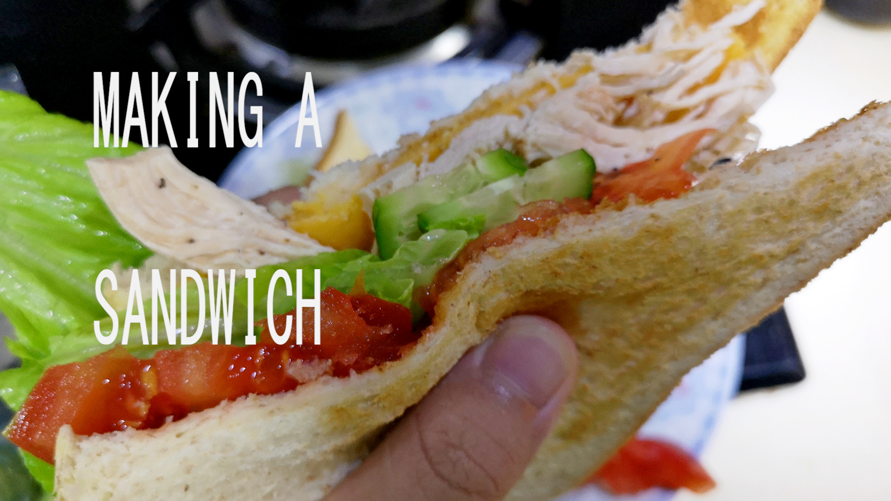

  &nbsp;&nbsp;&nbsp;&nbsp;

## Chicken
- Onion
- Carrot
- Celery
- Whole peppercorns
- Smashed garlic
- Bay leaf
- 0.5 Lemon, squeezed
- Salt
- Simmer 1 hr

## Other Things
- Any real cheese
- Organic leaf lettuce
- Toasted whole wheat bread

## Storing Chicken
- Use heat resistant plastic bags
- Double boil to reheat
